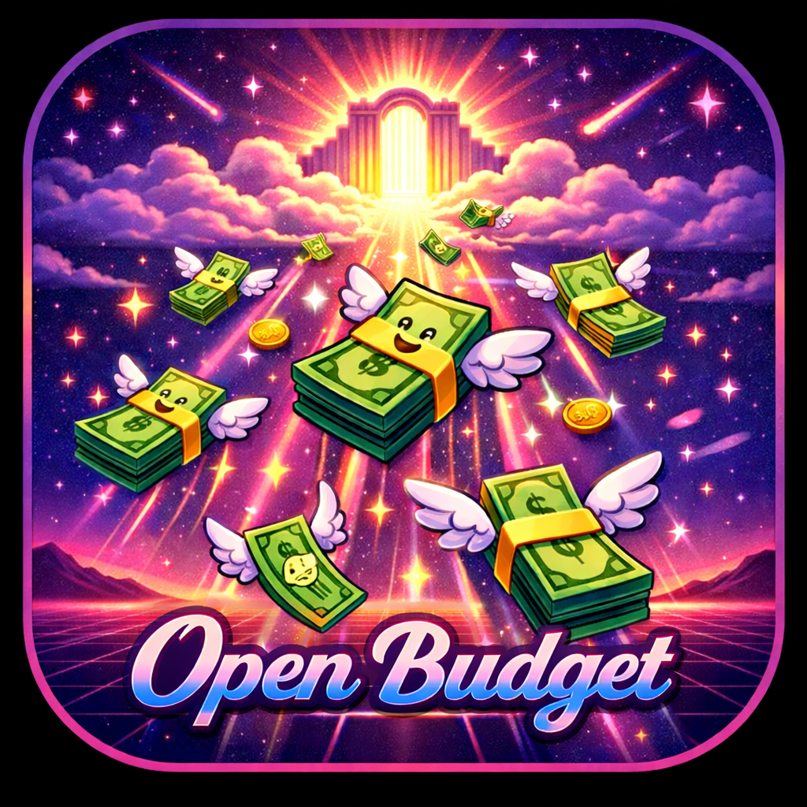

# 🎹🦞 Open Budget

A fully free, open source personal finance app that helps people budget, teaches money saving strategies, and tracks spending. Built with Flutter for iOS and Android.



## ✨ Features

### Core Budgeting
- **Zero-based budgeting** - Every dollar has a job
- **Digital envelope system** - Track spending by category
- **Budget templates** - Quick start presets (student, family, etc.)
- **Rolling budgets** - Unused funds carry over (optional)

### Expense Tracking
- **Fast manual entry** - Log expenses in 3 taps
- **Recurring transactions** - Auto-add subscriptions/bills
- **Categories + tags** - Flexible organization
- **Smart categorization** - Learns from your patterns

### Savings Goals
- **Visual progress bars** - Watch your money grow
- **Target date tracking** - Know when you'll reach your goal
- **Monthly target calculation** - Break it down to monthly savings
- **Celebrate achievements** - Gamified goal completion

### Smart Insights
- **Spending analysis** - "You spent 40% more on dining this month"
- **Category breakdowns** - Visual charts of where money goes
- **Trends over time** - Monthly and yearly comparisons
- **Anomaly detection** - Spot unusual spending

### Financial Education
- **Built-in tips** - Context-aware financial advice
- **Money strategies library** - 52-week challenge, envelope method, etc.
- **Mini-courses** - Learn budgeting fundamentals
- **Achievements** - Gamify good financial habits

### Privacy & Security
- **Local-only option** - Zero cloud dependency
- **Encrypted backup** - Optional cloud sync to your own storage
- **Export everything** - CSV, JSON, PDF reports
- **No account required** - Use immediately, no signup friction

## 🛠 Tech Stack

- **Framework:** Flutter 3.4+
- **State Management:** Riverpod
- **Local Database:** Hive (offline-first)
- **Navigation:** Go Router
- **Charts:** FL Chart
- **Architecture:** Clean Architecture

## 🚀 Getting Started

### Prerequisites
- Flutter SDK 3.4.0 or higher
- Dart SDK
- Android Studio / Xcode (for emulators)

### Installation

```bash
# Clone the repository
git clone https://github.com/yourusername/open_budget.git
cd open_budget

# Install dependencies
flutter pub get

# Run the app
flutter run
```

### Building for Release

```bash
# Android APK
flutter build apk --release

# Android App Bundle
flutter build appbundle --release

# iOS
flutter build ios --release
```

## 📁 Project Structure

```
lib/
├── core/
│   ├── database/           # Hive database service
│   ├── domain/
│   │   ├── entities/       # Data models
│   │   ├── repositories/   # Repository interfaces
│   │   └── usecases/       # Business logic
│   ├── theme/              # AppTheme, colors, styles
│   ├── constants/          # App constants
│   └── utils/              # Utilities
├── features/
│   ├── transactions/       # Expense/income tracking
│   ├── budget/             # Budget envelopes
│   ├── goals/              # Savings goals
│   ├── insights/           # Analytics & charts
│   ├── education/          # Financial literacy
│   └── settings/           # App settings
├── shared/
│   ├── widgets/            # Reusable components
│   └── utils/              # Shared utilities
└── config/
    └── app_router.dart     # Navigation config
```

## 🎨 Design System

The app features a **dark-first, synthwave-inspired** design:
- Deep purple background (#0F0F1A)
- Neon pink accents (#EC4899)
- Purple primary (#7C3AED)
- Green for income (#10B981)
- Red for expenses (#EF4444)
- Blue for savings (#3B82F6)

## 📱 Screenshots

*Coming soon*

## 🤝 Contributing

Contributions are welcome! This is an open source project aimed at helping people achieve financial freedom.

1. Fork the repository
2. Create a feature branch (`git checkout -b feature/amazing-feature`)
3. Commit your changes (`git commit -m 'Add amazing feature'`)
4. Push to the branch (`git push origin feature/amazing-feature`)
5. Open a Pull Request

## 📄 License

This project is licensed under the MIT License - see LICENSE for details.

## 🙏 Acknowledgments

- Built with ❤️ for financial freedom
- Icon design: Cosmic synthwave winged money
- Inspired by the 80s vision of a better financial future

---

"Stay retro, stay financially secure." 🌆
